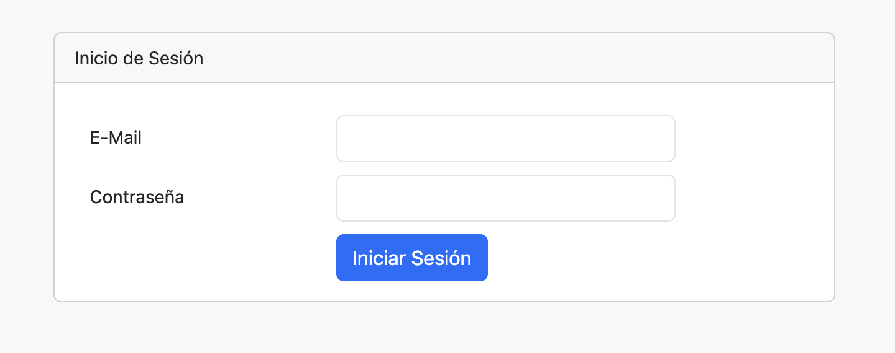
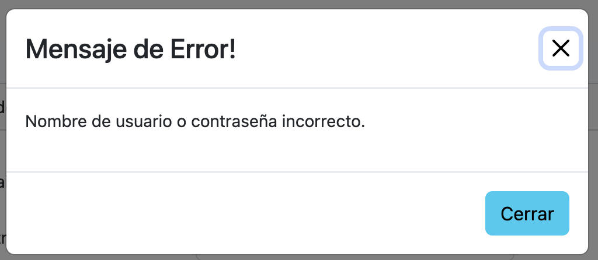
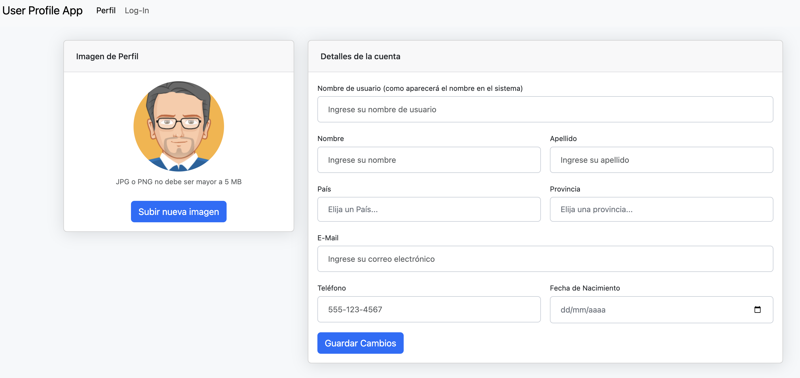
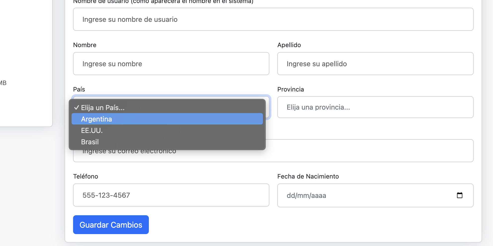

# Descripción

## Se pide...

### Routing (2)

- /profile --> muestra el perfil del usuario
- /login --> muestra el formulario de LogIn
- / --> redirecciona a /profile
- cualquier otra ruta --> redirecciona a /profile

Nota: No se puede navegar la ruta "/profile" si el usuario no tiene sesión iniciada.

### Comportamiento

Los formularios deben ser hechos con Reactive Forms.

#### LogIn (1)

- El usuario ingresa e-mail y password
- Hace click en "Iniciar Sesión" y se valida que dichos datos sean válidos

Los usuarios serán:
- Nombre de usuario: mail personal
- Contraseña: LEGAJO@APELLIDO(primera_letra_nombre_minuscula)
  - Ejemplo: 38438@Piemontesif

##### Datos incorrectos

- Se muestra un mensaje de error (ver MockUps)

##### Datos correctos

- Se redirecciona al Perfil
  - La sesión debe mantenerse, si hago F5 no se deben perder los datos

#### Perfil del Usuario

#### Actualizar imagen del usuario (1)

- Se debe poder elegir una imagen, y al hacer click en "Subir nueva imagen" esta debe ser almacenada y reemplazada en la pantalla

##### Validaciones (se deben mostrar los mensajes de error)

- La imagen debe ser un PNG o JPG
- La imagen no debe superar los 5 MB

#### Actualizar los datos del usuario (3)

- Se debe permitir almacenar y actualizar todos los datos del usuario mostrados en el MockUp
- Tanto el país como la provincia son campos seleccionables
- Los datos de país y provincia son "mockeados" (ver "Datos de soporte")

##### Validaciones (1)

- Nombre de usuario: Debe tener al menos 8 caracteres y menos de 50
- Nombre: requerido, máximo 20 caracteres.
- Apellido: requerido, máximo 20 caracteres.
- Pais / Provincia: requeridos.
- E-Mail: tiene que ser un tipo email, requerido, máximo 100 caracteres.
- Fecha de nacimiento: requerido, desde el año 1950 hasta 2005

##### Validación personalizada: (1)

- Telefono: requerido, formato XXX-XXX-XXX

### Estilos (1)

- NavBar con 2 botones
  - Perfil --> navega a /profile
  - Log-In / Log-Out --> navega a /login o elimina la sesión
- Para celular y PC

### Datos de soporte

- País y Provincia

```JSON
[
    {
        "pais": "Argentina",
        "provincias": [
            "Buenos Aires", "CABA", "Catamarca", "Chaco", "Chubut", "Córdoba", "Corrientes",
            "Entre Ríos", "Formosa", "Jujuy", "La Pampa", "La Rioja", "Mendoza", "Misiones",
            "Neuquen", "Río Negro", "Salta", "San Juan", "San Luis", "Santa Cruz", "Santa Fé",
            "Santiago del Estero", "Tierra del fuego", "Tucumán"
        ]
    },
    {
        "pais": "EE.UU.",
        "provincias": ["Miami", "Nueva York", "Texas", "Ohio", "California"]
    },
    {
        "pais": "Uruguay",
        "provincias": ["Artigas", "Canelones", "Cerro Largo", "Colonia", "Durazno", "Flores", "Florida",
        "Lavalleja", "Maldonado", "Montevideo", "Paysandu", "Río Negro", "Rivera", "Rocha", "Salto",
        "San José", "Soriano", "Tacuarembo", "Treinta y Tres"]
    }
]

```

### Ayuda

- Utilizar el siguiente artículo para obtener ayuda para resolver el Upload File: https://academind.com/tutorials/angular-image-upload-made-easy

- Url de BackEnd: http://userprofile.nhorenstein.com/swagger/index.html

### MockUps

#### LogIn



#### Mensaje de Error



#### Pagina Principal Perfil



##### DropDowns


